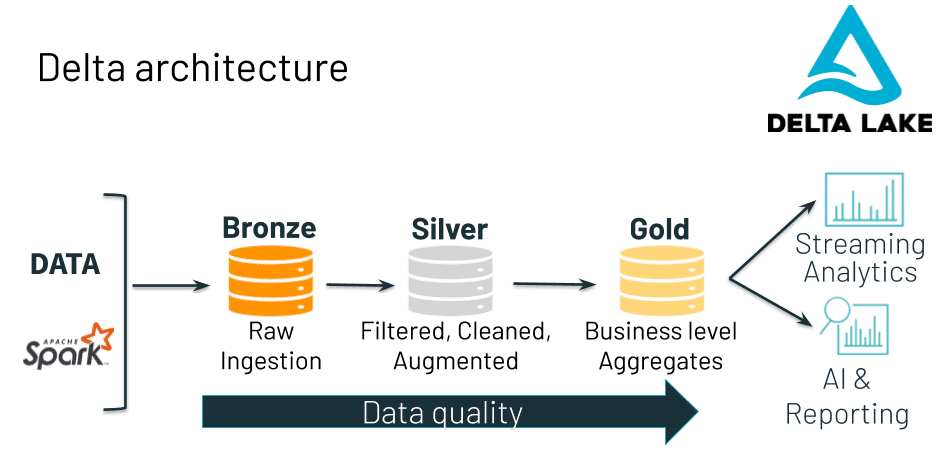
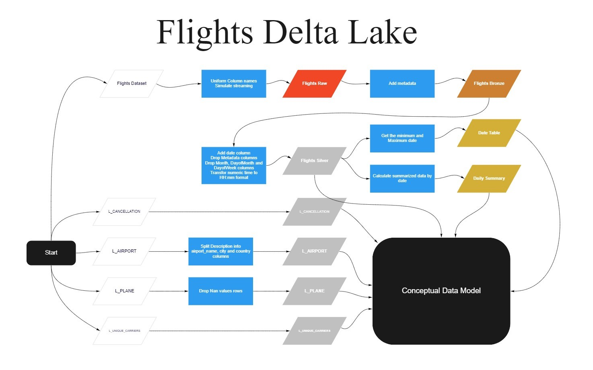
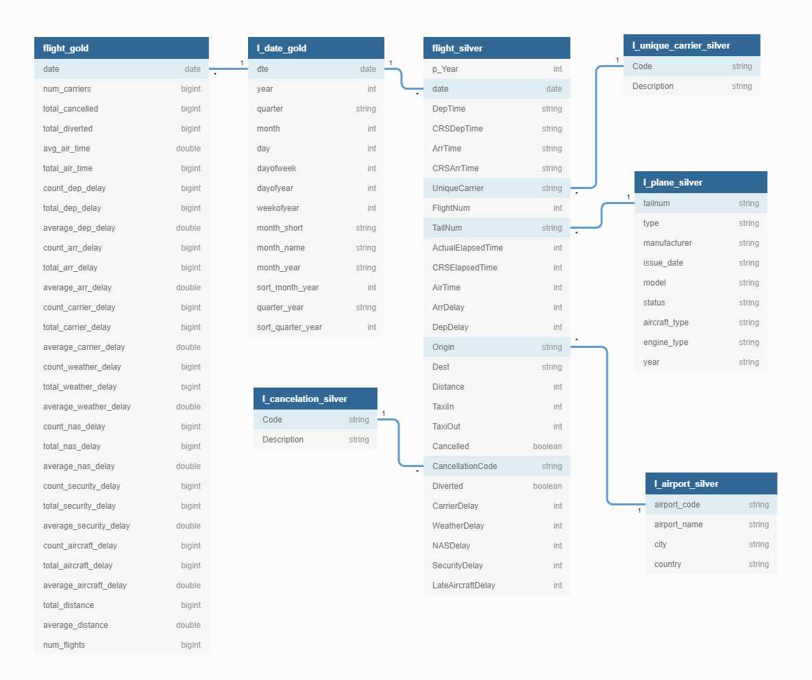
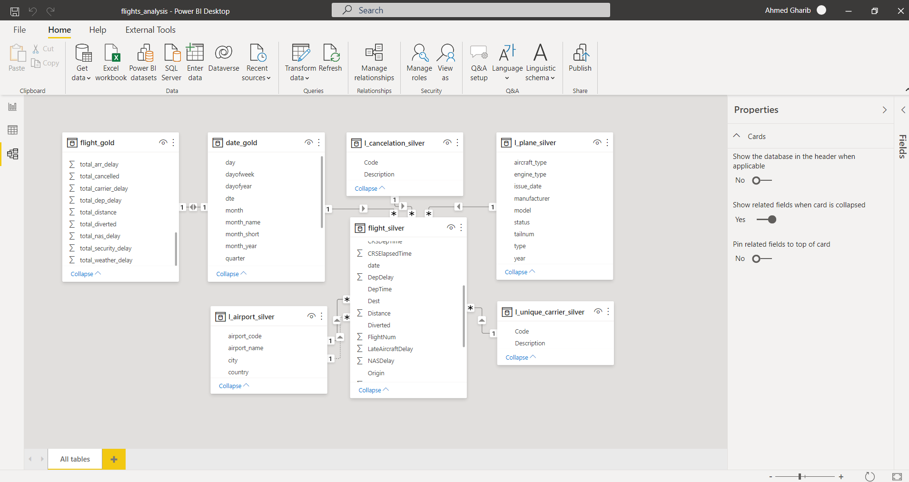

# Building Delta Lake-house for flights in United states

## Data Engineering Capstone Project

### Project Summary

The objective for this project is to build a delta lake for US flights data  
and to build ETL pipline to move the data through each table in the delta lake archticture from raw (bronz) cleaned (silver) to aggregated (gold) tables  
to reach at this step to a star schema model ready for analysts to create dashboards 
we will also simulate the process of receiving the raw data via streaming app like Apache Kafka

The project follows the follow steps:

* [Step 1: Scope the Project and Gather Data](#step1)
* [Step 2: Explore and Assess the Data](#step2)
* [Step 3: Define the Data Model](#step3)
* [Step 4: Run ETL to Model the Data](#step4)
* [Step 5: Complete Project Write Up](#step5)

### Step 1: Scope the Project and Gather Data

#### Scope

in this project our goal is to build a delta lake for the US flights dataset to:

1. Store the raw data.
2. Build a star schema data model for analysis.

#### Technology used and reasons

* for this purpose we will use Delta Lake along with Pyspark 
* reasons for our choice:
    1. Delta Lake is an open-source storage layer that brings reliability to data lakes.
    2. Delta Lake provides ACID transactions, scalable metadata handling, and unifies streaming and batch data processing.4
    3. Delta Lake runs on top of an existing data lake and is fully compatible with Apache Spark APIs.

#### Delta lake archticture

The Delta architecture design pattern consists of landing data in successively cleaner Delta Lake tables from raw (Bronze) to clean (Silver) to aggregate (Gold). This is also referred to as a “multi-hop” architecture. You move data through this pipeline as needed.  
The end outputs are actionable insights, clean data for machine learning applications,  dashboards, and reports of business metrics.

#### Approach

1. We will simulate the process of streaming the flights dataset.
2. Add metadata and move it to bronze table.
3. Transform and augment the bronze table then move it to silver table.
4. Create date gold table.
5. Create daily summary gold table.
6. Collect and transfor lookup tables into silver.
As you can see in the following flowchart

#### Describe and Gather Data

|Dataset|Source|Description|
|--|--|--|
|Flights Dataset from Nov.1987 to Apr.2008|[Data Expo 2009](https://community.amstat.org/jointscsg-section/dataexpo/dataexpo2009) The dataset is provided for download as csv files per year or as zipped file for the whole dataset|Monthly data reported by US certified air carriers that account for at least one percent of domestic scheduled passenger revenues--includes scheduled and actual arrival and departure times for flights
|Flights Dataset from May.2008 to Apr.2021|[Bearau of Transportation Statistics](https://www.transtats.bts.gov/DL_SelectFields.asp?gnoyr_VQ=FGJ&QO_fu146_anzr=b0-gvzr) You can select the columns you need and chose the year and month to download it as csv|Monthly data reported by US certified air carriers that account for at least one percent of domestic scheduled passenger revenues--includes scheduled and actual arrival and departure times for flights.
|L_AIRPORT|[link](https://www.transtats.bts.gov/Download_Lookup.asp?Y11x72=Y_NVecbeg)|Airport lookup table
|L_CANCELLATION|[link](https://www.transtats.bts.gov/Download_Lookup.asp?Y11x72=Y_PNaPRYYNgVba)|Cancelation code lookup table
|L_UNIQUE_CARRIERS|[link](https://www.transtats.bts.gov/Download_Lookup.asp?Y11x72=Y_haVdhR_PNeeVRef)|Unique carier lookup table
|L_PLANE|[link](https://drive.google.com/file/d/12A4I3W3dGqwAbLjgOeLsMFkIyq8awRKD/view?usp=sharing)|Plane lookup table

* Flights Dataset

|col_name|data_type|Description
| -- | -- | -- |
|p_Year|int|Year
|Month|int|Month
|DayofMonth|int|Day of Month
|DayOfWeek|int|Day of Week
|DepTime|double|Actual Departure Time (local time: hhmm)
|CRSDepTime|int|CRS Departure Time (local time: hhmm)
|ArrTime|double|Actual Arrival Time (local time: hhmm)
|CRSArrTime|int|CRS Arrival Time (local time: hhmm)
|UniqueCarrier|string|Unique Carrier Code. When the same code has been used by multiple carriers, a numeric suffix is used for earlier users, for example, PA, PA(1), PA(2). Use this field for analysis across a range of years
|FlightNum|int|Flight Number
|TailNum|string|Tail Number
|ActualElapsedTime|double|Elapsed Time of Flight, in Minutes
|CRSElapsedTime|int|CRS Elapsed Time of Flight, in Minutes
|AirTime|string|Flight Time, in Minutes
|ArrDelay|double|Difference in minutes between scheduled and actual arrival time. Early arrivals show negative numbers
|DepDelay|double|Difference in minutes between scheduled and actual departure time. Early departures show negative numbers
|Origin|string|Origin Airport
|Dest|string|Destination Airport
|Distance|double|Distance between airports (miles)
|TaxiIn|string|Taxi In Time, in Minutes
|TaxiOut|string|Taxi Out Time, in Minutes
|Cancelled|int|Cancelled Flight Indicator (1=Yes)
|CancellationCode|string|Specifies The Reason For Cancellation
|Diverted|int|Diverted Flight Indicator (1=Yes)
|CarrierDelay|string|Carrier Delay, in Minutes
|WeatherDelay|string|Weather Delay, in Minutes
|NASDelay|string|Weather Delay, in Minutes
|SecurityDelay|string|Security Delay, in Minutes
|LateAircraftDelay|string|Late Aircraft Delay, in Minutes

* L_AIRPORT

|col_name|data_type|Description
| -- | -- | -- |
|Code|string|Airport Code
|Description|string|Airport discription in the following format (city, country:name)

* L_CANCELLATION

|col_name|data_type|Description
| -- | -- | -- |
|Code|string|Cancelation code A to D
|Description|string|Cancelation reason description

* L_UNIQUE_CARRIERS

|col_name|data_type|Description
| -- | -- | -- |
|Code|string|Unique carier code
|Description|string|Carier description

* L_PLANE

|col_name|data_type|Description
| -- | -- | -- |
|tailnum|string|Tail Number
|type|string|Tyoe of the plane
|manufacturer|string|Manufacturer
|issue_date|date|Date of manufacturing
|model|string|Model of the plane
|status|string|Status of the plane (valid or not)
|aircraft_type|string|Air craft type
|engine_type|string|Engine Type
|year|int|Year of manufacturing

### Step 2: Explore and Assess the Data

#### Explore the Data

 Flights Dataset
    1. column names are not the same for the 2 sources they came from
    2. Year, Month, DayofMonth columns need to be combined into date column
    3. DepTime, CRSDepTime, ArrTime, CRSArrTime is numeric value instead of timestamp

* L_AIRPORT
    1. Description column need to be splited into airport_name, city and country columns
* L_PLANE
    1. there are null values in all columns except for tailnum

#### Cleaning Steps

* Flights Dataset
    1. Uniform Column names.
    2. Simulate streaming app.
    3. Add metadata.
    4. Move to bronze table
    5. Add date column
    6. Drop Metadata columns
    7. Drop Month, DayofMonth and DayofWeek columns
    8. Transform numeric time to HH:mm format
    9. Move to Silver Table
* L_AIRPORT
    1. Split Description into airport_name, city and country columns
    2. Move to silver table
* L_PLANE
    1. Drop Nan values rows
    2. Move to silver table
* L_UNIQUE_CARRIERS
    1. No transformation needed and will move it to silver table
* L_CANCELLATION
    1. No transformation needed and will move it to silver table

### Step 3: Define the Data Model

#### 3.1 Conceptual Data Model

#### Connect to BI tools

Users can connect to the data model using power BI and the provided M function provided by the microsoft MVP Gerhard Brueckl [here](https://github.com/gbrueckl/connectors/blob/master/powerbi/fn_ReadDeltaTable.pq)  
As you can see in the following screenshot

And they answer any question they want with the data like:

1. What is the main reason for delays.
2. what is the trend for the number of delayed flights by year.
3. When is the best time of day/day of week/time of year to fly to minimise delays?
4. Do older planes suffer more delays?
5. How does the number of people flying between different locations change over time?
6. How well does weather predict plane delays?
and too many other questions

#### 3.2 Mapping Out Data Pipelines

Refer to the flights flowchart above

### Step 4: Run Pipelines to Model the Data

#### 4.1 Create the data model

As we already build stream pipeline from raw to silver 
let's retrive the rest of the data

#### 4.2 Data Quality Checks

* Compare null values for flights raw, bronze and silver
* Compare top 10 UniqueCarrier, origin, dest for all tables flights raw, bronze and silver
* Compare null values for lookup tables before and after transformations
* Compare null values for daily summary gold table

#### Step 5: Complete Project Write Up

* Clearly state the rationale for the choice of tools and technologies for the project. 
    As mentioned in the project scop delta lake is new technology brings the best of Data lake and Data warehouses
* Propose how often the data should be updated and why. 
    The data should be updated monthly as the source provide them
* Write a description of how you would approach the problem differently under the following scenarios:
    1. The data was increased by 100x. 
    We can deploy our model to the cloude and scale up
    2. The data populates a dashboard that must be updated on a daily basis by 7am every day. 
    We can schadule the stream to run everyday at 4am  
    3. The database needed to be accessed by 100+ people. 
    Delta lake can handle as many users with no issues

#### Find me in social media

